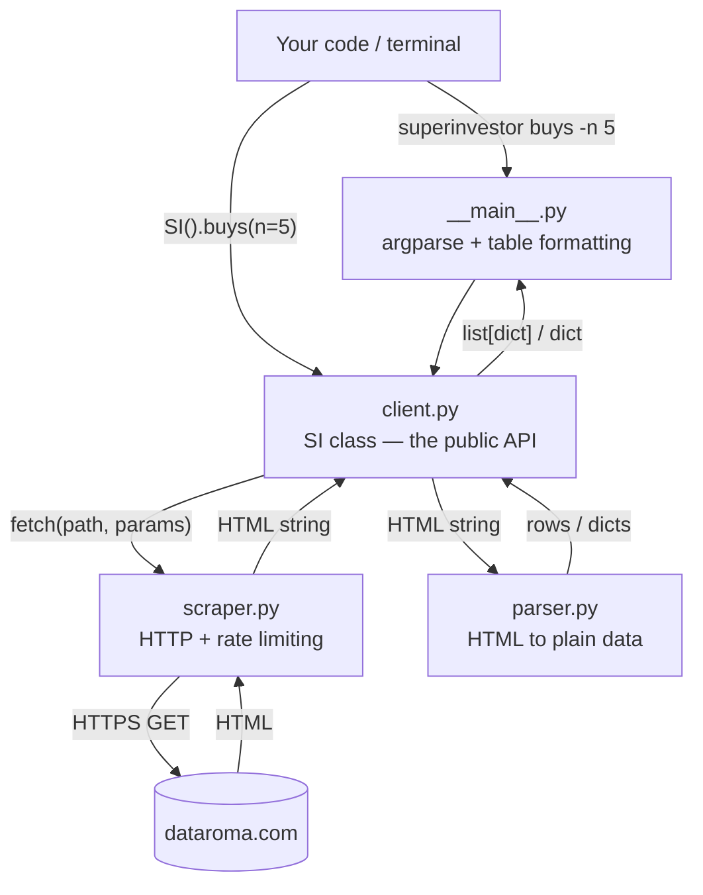
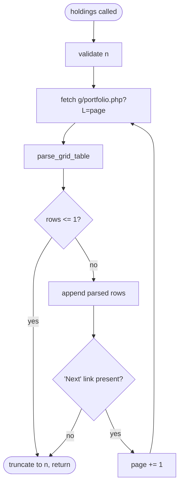

# Architecture

*How `superinvestor` is built, how a call flows through it, and why it's shaped this way. Useful if you're debugging unexpected output, contributing a fix, or deciding whether to depend on it.*

The whole project is roughly 700 lines across four modules. You can read all of it in one sitting, and this page is a map for doing that.

## The layers

Three layers, strictly ordered: HTTP, parsing, then the public API — plus a CLI that sits on top and only knows about the public API.



The rule that keeps this honest: **`scraper.py` never parses, and `parser.py` never performs I/O.** The scraper takes a path and returns an HTML string; the parser takes an HTML string and returns data. Only `client.py` talks to both. This is what makes the parser testable without a network connection — you hand it saved HTML and assert on the result.

## Module map

| File | Lines | Responsibility |
|---|---|---|
| `superinvestor/__init__.py` | 3 | Exports exactly one name: `SI` |
| `superinvestor/scraper.py` | 37 | One function, `fetch()`. Session, headers, rate limit, timeout. |
| `superinvestor/parser.py` | 191 | Pure HTML→data functions. No network, no state. |
| `superinvestor/client.py` | 271 | The `SI` class, endpoint knowledge, row→dict mapping, validation. |
| `superinvestor/__main__.py` | 167 | argparse CLI and the table formatters. No business logic. |

`tests/` holds two files covering argument validation and CLI flag handling.

## The request layer — `scraper.py`

The entire HTTP surface is one function:

```python
def fetch(path: str, params: dict | None = None) -> str
```

It joins `path` onto `BASE_URL` (`https://www.dataroma.com/m`), issues a GET through a module-level `requests.Session`, calls `raise_for_status()`, and returns `resp.text`.

Four decisions live here:

**A shared session.** One `requests.Session` at module scope, so TCP connections are reused across every call in the process rather than reopened each time.

**A browser User-Agent.** The session sends a Chrome UA string. DataRoma serves an ordinary public website; this makes requests look like the browser traffic it expects.

**A 30-second timeout.** Every request is bounded, so a hung connection surfaces as `requests.exceptions.Timeout` instead of blocking forever.

**No retries.** A failed request raises immediately. Retry policy is the caller's decision, not the library's.

### Rate limiting

The most consequential design choice in the project:

```python
_last_request_time = 0.0
_MIN_INTERVAL = 1.5  # seconds between requests

def fetch(path, params=None):
    global _last_request_time
    elapsed = time.time() - _last_request_time
    if elapsed < _MIN_INTERVAL:
        time.sleep(_MIN_INTERVAL - elapsed)
    ...
```

Before every request, `fetch()` sleeps for whatever remains of a 1.5-second window since the last one.

Three things follow, and they're worth internalising:

1. **The limiter is process-global, not per-instance.** `_last_request_time` is a module-level variable. Ten `SI()` instances share one rate limiter — creating more instances will not make anything faster.
2. **It is not configurable.** No parameter, no environment variable. Deliberately: DataRoma is a free service under no obligation to serve you, and an easy override would get used.
3. **It is not thread-safe.** The read-check-sleep-write sequence on `_last_request_time` isn't synchronised. Concurrent threads can pass the check together and issue simultaneous requests. The library is designed for sequential use; if you need concurrency, serialise calls behind your own lock.

This is why the library is *polite by default* rather than fast, and why [caching is left to you](#no-caching-by-design).

## The parsing layer — `parser.py`

Stateless functions from HTML string to plain data. DataRoma's pages are server-rendered tables, most of them under `<table id="grid">`, which makes the extraction simple.

| Function | Input | Output |
|---|---|---|
| `parse_grid_table(html)` | Page HTML | `list[list[str]]` — the grid table as rows of cell text |
| `parse_info_table(html, table_id)` | Page HTML | `dict[str, str]` — a key/value table (e.g. `t1` on the stock page) |
| `parse_activity_by_quarter(html)` | Activity page HTML | `list[dict]` — activity grouped by quarter |
| `parse_activity_string(text)` | `"Reduce 4.32%"` | `("Reduce", 4.32)` |
| `parse_holdings_row(cells)` | One row's cells | A holder `dict` |

### Quarter grouping

`parse_activity_by_quarter()` handles the one genuinely non-trivial structure. DataRoma's activity page is a flat table where quarter boundaries are marked by **single-cell header rows** like `Q4  2025`, with each manager's action listed underneath.

The parser walks rows in order, keeping a `current_quarter` accumulator. A single-cell row matching `Q\d\s+\d{4}` closes the previous quarter and opens a new one; every other row is classified with `parse_activity_string()` and accumulated into the matching `buy` / `add` / `reduce` / `sell` bucket. When a quarter closes, `_finalize_quarter()` computes the `net` figures:

```python
net.count  = (buy.count  + add.count)  − (reduce.count  + sell.count)
net.shares = (buy.shares + add.shares) − (reduce.shares + sell.shares)
```

`net` is computed here, not supplied by DataRoma — it's the one derived value the library adds. See [Core Concepts](Concepts.md#net).

### Forgiving by design

Every conversion helper returns a fallback instead of raising:

| Helper | On failure |
|---|---|
| `_parse_int` / `_safe_int` | `0` |
| `_parse_float` / `_safe_float` | `None` |
| Row parsers | `None` (the row is skipped) |

Rows with too few cells, and header rows, are filtered out.

This trades loud failure for graceful degradation, and it has a specific consequence you should know about: **when DataRoma changes its HTML, the library returns empty lists and zeroed fields rather than raising an exception.** An empty result is the symptom of an upstream layout change, not necessarily of an empty dataset. If a method that normally returns data suddenly returns `[]`, check the source page structure before assuming the data is gone.

## The client layer — `client.py`

`SI` holds the endpoint map and converts parsed rows into the documented dicts. Each public method follows the same shape: validate → fetch → parse → map → truncate.

### Endpoint map

| Method | Path | Parameters |
|---|---|---|
| `holdings()` | `g/portfolio.php` | `pct=0`, `o=c`, `L=<page>` |
| `buys()` | `g/portfolio_b.php` | `q=q` or `q=h` |
| `sells()` | `g/portfolio_s.php` | `q=q` or `q=h` |
| `stock()` | `stock.php` **and** `activity.php` | `sym=<TICKER>`; activity adds `typ=a` |
| `managers()` | `managers.php` | — |

Note the period mapping: the library's public `period="6m"` becomes the upstream parameter `q=h`. The translation table is `_PERIOD_PARAMS` at the top of the module, and `_period_param()` raises `ValueError` for anything not in it.

### Validation happens first

`_validate_limit()` and `_period_param()` run **before** any HTTP request, so invalid arguments fail instantly rather than after a network round-trip. `_validate_limit()` explicitly rejects booleans — `isinstance(True, int)` is `True` in Python, so `n=True` would otherwise slip through as `n=1`.

### Pagination in `holdings()`

`holdings()` is the only method that makes more than a fixed number of requests. DataRoma paginates the grand portfolio, so the client loops:



It stops on either signal: a page with nothing but a header, or no `Next` link.

**`n` truncates, it does not limit fetching.** The slice happens after the loop finishes, so `holdings(n=10)` fetches every page and then throws most of the results away. It costs exactly as much as `holdings()`. This is the library's slowest operation by a wide margin — with the 1.5-second floor, a full run takes tens of seconds.

Making `n` stop the loop early would be a genuine improvement; it just hasn't been done. Contributions welcome.

## The CLI layer — `__main__.py`

Deliberately thin: build the argparse tree, call the matching `SI` method, hand the result to a formatter. It contains no data logic, which is why the Python API and the CLI can never disagree.

One notable trick: `--json` is defined once on a shared parent parser and attached to both the root parser and every subparser, with `default=argparse.SUPPRESS`. That's what makes both orderings work:

```bash
superinvestor --json buys -n 5
superinvestor buys -n 5 --json
```

`SUPPRESS` stops the subparser's default from overwriting a flag already set at the root level. Without it, the flag would be silently dropped in one of the two orderings. `tests/test_cli.py` covers exactly this.

Errors from the client layer aren't caught, so a `ValueError` or a `requests` exception reaches the terminal as a traceback — see [CLI Reference](CLI-Reference.md#known-rough-edge-negative--n).

## Design decisions

### No caching, by design

Every call is a live fetch. There is no cache, memoisation, or on-disk store.

The reasoning: caching means choosing a TTL, and the right TTL depends entirely on your use case. 13F data changes only quarterly, so a script run twice in an hour could reasonably cache for hours — but a library that silently returns stale data surprises people, and an invalidation API would be more surface area than the problem deserves.

Holding the result yourself is one line:

```python
si = SI()
buys = si.buys(n=20)      # fetched once
# reuse `buys` freely
```

Or on the command line, redirect it:

```bash
superinvestor holdings --json > holdings.json
```

### Plain dicts, not model classes

Everything returned is built from `dict`, `list`, `str`, `int`, and `float`. No dataclasses, no pydantic models, no ORM.

This means results are JSON-serialisable as they come, work with `pandas.DataFrame()` directly, and require no imports to inspect. The cost is no attribute access and no static typing on fields — an acceptable trade for a library whose entire job is handing you data.

### `lxml` as the parsing backend

Every `BeautifulSoup(html, "lxml")` call names the backend explicitly rather than relying on the default. It's faster than `html.parser`, and it's more tolerant of the malformed markup real-world pages contain. That's why `lxml` is a hard dependency.

### Three dependencies, deliberately

`requests`, `beautifulsoup4`, `lxml`. That's the whole list, and [CONTRIBUTING.md](../../CONTRIBUTING.md) asks for discussion before a fourth. A small dependency footprint is what makes this safe to drop into an existing project.

## Known inconsistencies

Documented honestly, because you'll notice them reading the source:

- **`managers()` parses HTML inside `client.py`.** It imports BeautifulSoup directly and walks the table itself, rather than delegating to `parser.py` like every other method. The layering separation described above holds everywhere except here. The extraction logic belongs in `parser.py`.
- **`_has_next_page(html, current_page)` ignores `current_page`.** It only checks for a `Next` link; the second parameter is unused.
- **`portfolio_value` from `managers()` is a display string**, e.g. `"$274 B"`, while every other numeric field is a real number. Sorting or arithmetic requires parsing it yourself.

None of these affect correctness. They're the natural rough edges of a small project, and each is a well-scoped first contribution.

## Extending it

Adding a new DataRoma page follows the existing grain:

1. Find the page and its query parameters on dataroma.com.
2. Add a parsing function to `parser.py` if the table shape is new — pure, HTML in, data out.
3. Add a method to `SI` that validates, calls `scraper.fetch()`, parses, and maps rows to dicts.
4. Add a subparser and a formatter to `__main__.py`.
5. Test the parser against saved HTML, not a live request.

Please [open an issue first](../../CONTRIBUTING.md#scope--whats-wanted) — the five-method surface is intentionally small.

---

**Next:** [Development →](Development.md) · **See also:** [API Reference](API-Reference.md) · [Back to index](README.md)
